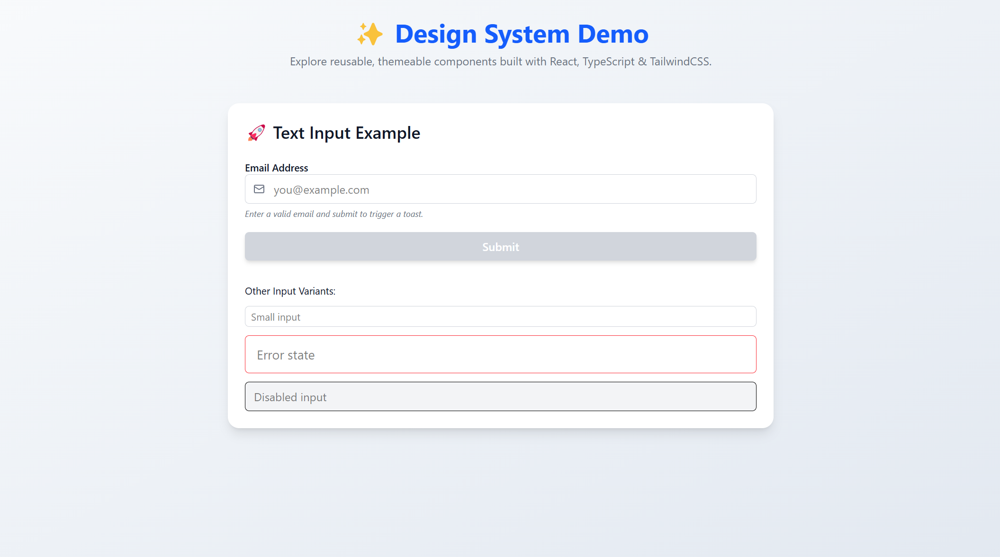
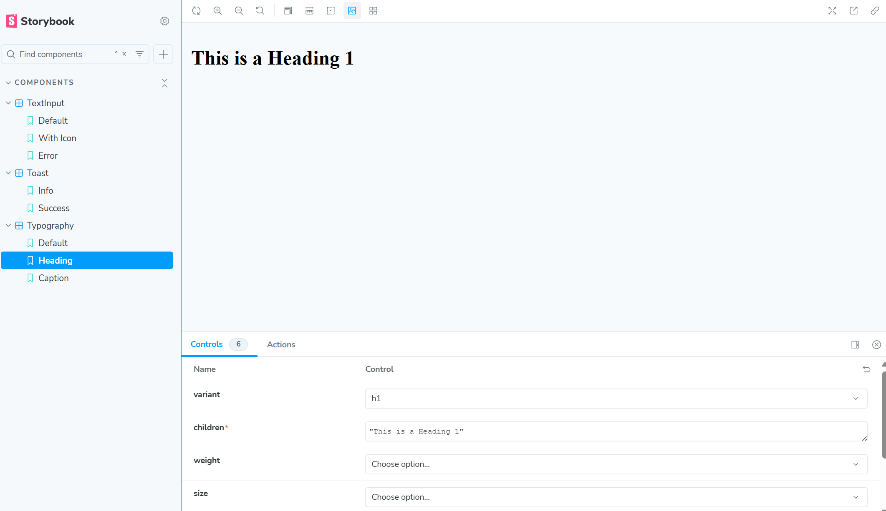

# Design System Assignment

This is a simple design system for apps. It has Typography, Text Input, and Toast components. Built with React, TypeScript, TailwindCSS, and Storybook.

## 📖 What’s Inside

- **Typography**: For headings (H1–H6), paragraphs, labels, captions, and helper text.
- **Text Input**: A form input with states like default, hover, focus, error, and disabled.
- **Toast**: A popup message (info, error, success, warning).

All components work on different screen sizes, support light/dark mode, and are accessible.

## 📂 Folder Structure


## 🛠️ How to Run

1. **Get the Code**:
   ```bash
   git clone https://github.com/technical-jitendra-kumar/Design_system.git
   cd DESIGN-System
   ```

2. **Install Stuff**:
   ```bash
   npm install
   ```

3. **Run the App**:
   ```bash
   npm run dev
   ```

4. **See Components in Storybook**:
   ```bash
   npm run storybook
   ```
   Open `http://localhost:6006` in your browser.

## 🌟 Features

- **Typography**: Different text styles, light/dark mode, accessible.
- **Text Input**: Works with keyboard, has error states, and icons.
- **Toast**: Shows messages, supports different types, and is accessible.

## 📜 Storybook Docs

Storybook has details for each component:
- Name and description
- Props (settings)
- Examples
- States (like hover, error)
- Accessibility info
- Theming and responsive notes

## 📦 Sharing

- **GitHub**: https://github.com/technical-jitendra-kumar/Design_system
- **Storybook Link**: https://67ff8eac92038e337c5b1ee8-zvbydzlwlt.chromatic.com/
- **Screenshots**:



